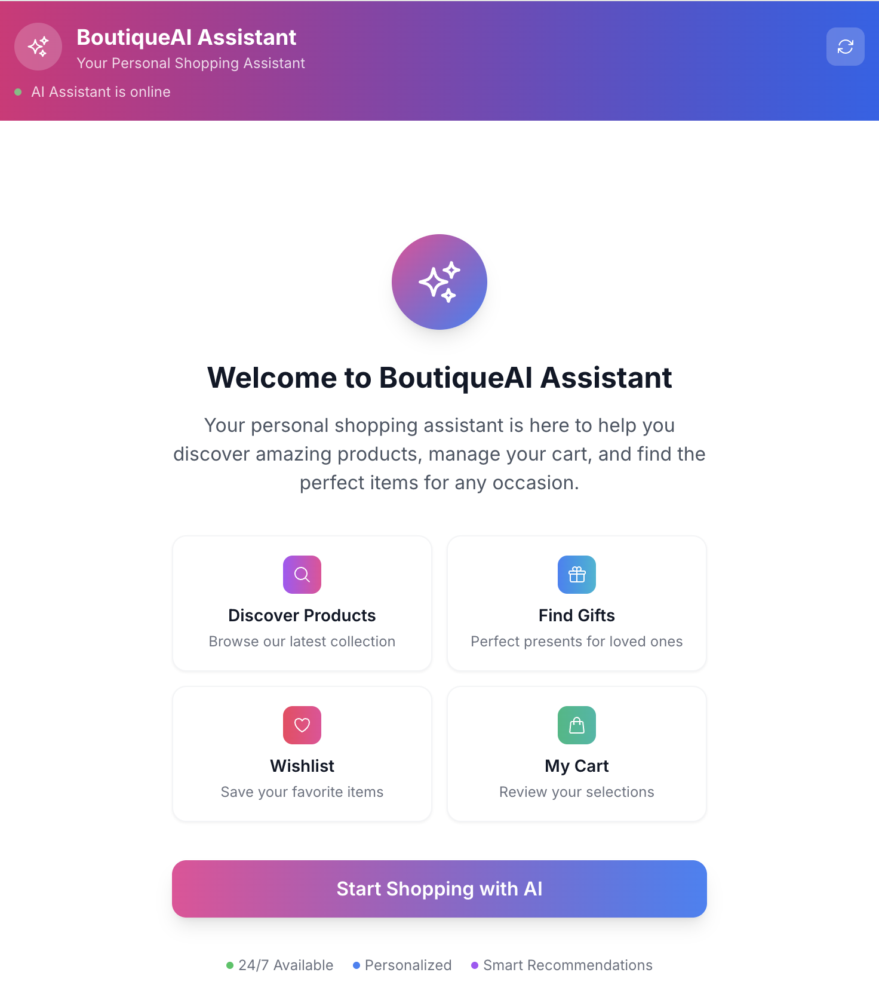
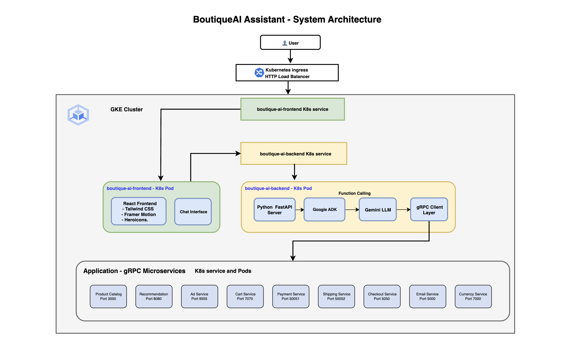
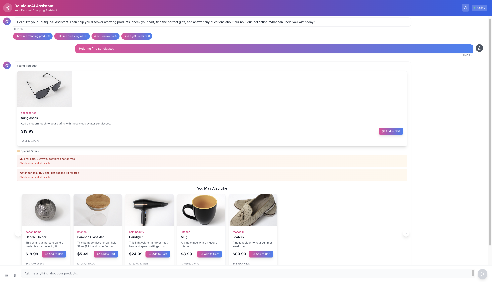
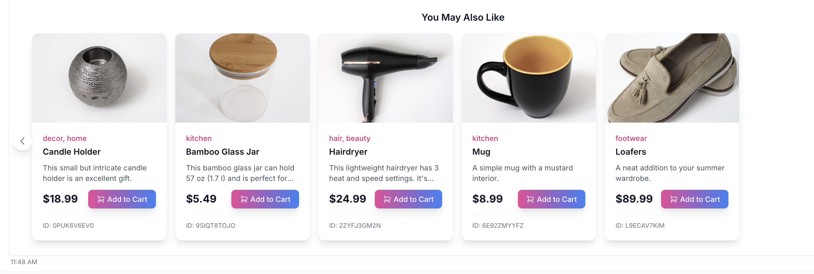
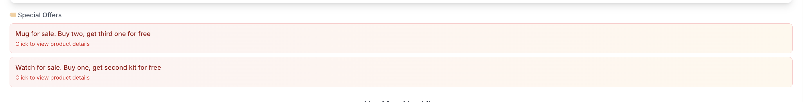
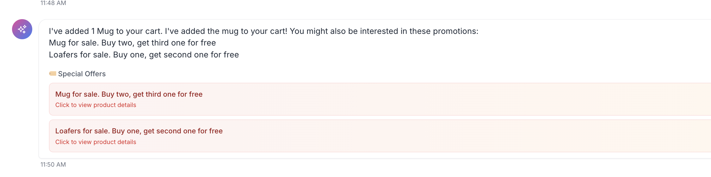
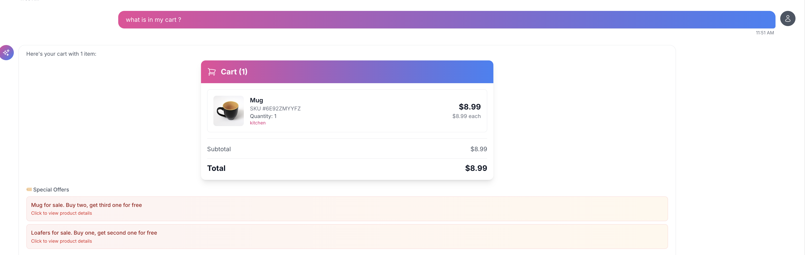
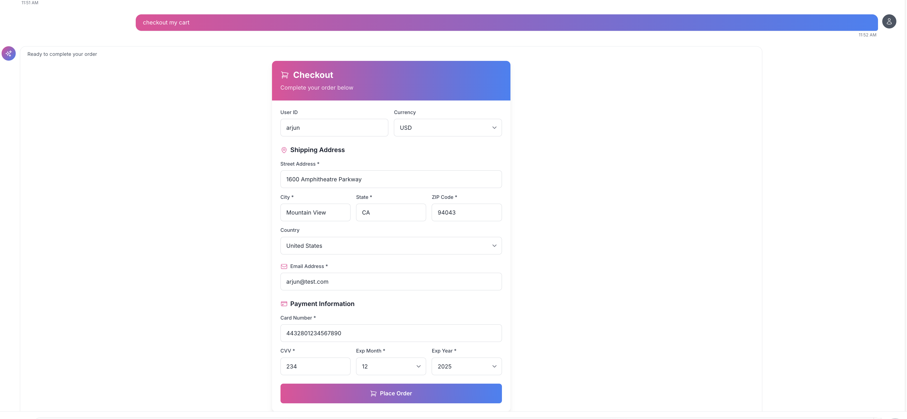
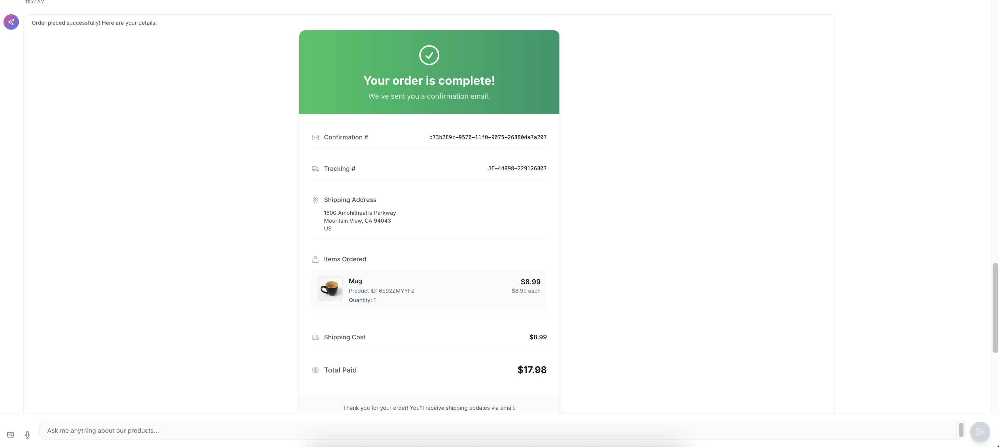

# BoutiqueAI Assistant

An e-commerce chat interface built with Google ADK, Gemini LLM, and FastAPI. Integrates with 9 gRPC microservices for complete shopping functionality. 





## Table of Contents

1. [Architecture](#1-architecture)
   - [System Architecture Diagram](#system-architecture-diagram)
   - [Key Architecture Components](#key-architecture-components)
   - [Backend (Python)](#backend-python)
   - [Frontend (React)](#frontend-react)

2. [Features](#2-features)
   - [AI Shopping Assistant](#ai-shopping-assistant)
   - [E-commerce Features](#e-commerce-features)
   - [Modern UI/UX](#modern-uiux)

3. [Product Demo](#3-product-demo)
   - [1. Welcome](#1-welcome)
   - [2. Product Search](#2-product-search)
   - [3. Product Recommendation](#3-product-recommendation)
   - [4. Product Ads](#4-product-ads)
   - [5. Add to Cart](#5-add-to-cart)
   - [6. View Cart](#6-view-cart)
   - [7. Checkout and Payment](#7-checkout-and-payment)
   - [8. Order Confirmation](#8-order-confirmation)

4. [Built With](#4-built-with)
   - [Frontend Technologies](#frontend-technologies)
   - [Backend Technologies](#backend-technologies)
   - [Dependencies](#dependencies)
   - [gRPC Microservices Integration](#grpc-microservices-integration)

5. [Prerequisites](#5-prerequisites)
   - [For Local Development](#for-local-development)
   - [For GKE Deployment](#for-gke-deployment)

6. [Quick Start](#6-quick-start)
   - [1. Clone and Setup](#1-clone-and-setup)
   - [2. Enhanced Local Development (Recommended)](#2-enhanced-local-development-recommended)
   - [3. Manual Development Setup](#3-manual-development-setup)
   - [4. gRPC URL Management](#4-grpc-url-management)
   - [5. Access the Application](#5-access-the-application)

7. [Usage Examples](#7-usage-examples)
   - [Product Search](#product-search)
   - [Price Filtering](#price-filtering)
   - [Shopping Cart](#shopping-cart)
   - [Recommendations](#recommendations)
   - [Order Confirmation](#order-confirmation)

8. [AI Agent Functions](#8-ai-agent-functions)
   - [Product Catalog Functions](#product-catalog-functions)
   - [Shopping Cart Functions](#shopping-cart-functions)
   - [Order Processing Functions](#order-processing-functions)
   - [Shipping & Payment Functions](#shipping--payment-functions)
   - [Additional Service Functions](#additional-service-functions)

9. [Component Architecture](#9-component-architecture)
   - [React Components](#react-components)
   - [Message Content Detection](#message-content-detection)

10. [Configuration](#10-configuration)
    - [Environment Variables](#environment-variables)

11. [gRPC & Protocol Buffers](#11-grpc--protocol-buffers)
    - [Key Files](#key-files)
    - [Microservices Defined in Proto](#microservices-defined-in-proto)
    - [How gRPC Works in This Project](#how-grpc-works-in-this-project)
    - [Example gRPC Usage](#example-grpc-usage)
    - [Regenerating gRPC Files (if needed)](#regenerating-grpc-files-if-needed)
    - [Why gRPC?](#why-grpc)
    - [Understanding Message Types](#understanding-message-types)
    - [Test Data](#test-data)

12. [Production Deployment to GKE](#12-production-deployment-to-gke)
    - [Prerequisites for GKE Deployment](#prerequisites-for-gke-deployment)
    - [Enhanced One-Command Deployment (Recommended)](#enhanced-one-command-deployment-recommended)
    - [Manual Deployment (Alternative)](#manual-deployment-alternative)
    - [Accessing Your Deployed Application](#accessing-your-deployed-application)
    - [Production Architecture](#production-architecture)

13. [Development](#13-development)
    - [File Structure](#file-structure)
    - [Enhanced Development Scripts](#enhanced-development-scripts)
    - [API Endpoints](#api-endpoints)
    - [Stopping Services](#stopping-services)
    - [Development Workflow Best Practices](#development-workflow-best-practices)

## 1. Architecture

### System Architecture Diagram


### Key Architecture Components

**Data Flow:**
1. **User Request** → React Frontend → FastAPI Backend
2. **AI Processing** → Google ADK Agent → Gemini API
3. **Microservice Calls** → gRPC Client → 9 Microservices
4. **Response Assembly** → Backend → Frontend → User

**Communication Patterns:**
- **Frontend ↔ Backend:** HTTP/REST API (JSON)
- **Backend ↔ AI:** Google ADK + Gemini API
- **Backend ↔ Microservices:** gRPC (Protocol Buffers)
- **Infrastructure:** Kubernetes Service Discovery

### Backend (Python)
- **FastAPI** - High-performance API server
- **Google Agent Development Kit (ADK)** - AI agent framework
- **gRPC** - Microservices communication
- **9 Microservices Integration:**
  - Product Catalog Service (Port 3550)
  - Cart Service (Port 7070) 
  - Recommendation Service (Port 8080)
  - Shipping Service (Port 50052)
  - Currency Service (Port 7000)
  - Payment Service (Port 50051)
  - Email Service (Port 5000)
  - Checkout Service (Port 5050)
  - Ad Service (Port 9555)

### Frontend (React)
- **React 18** - Modern React with hooks
- **Tailwind CSS** - Utility-first styling
- **Framer Motion** - Smooth animations
- **Heroicons** - Beautiful icons
- **ReactMarkdown** - Rich text rendering
- **Axios** - HTTP client for API communication

## 2. Features

### AI Shopping Assistant
- **Natural Language Search** - Search products using conversational language
- **Price Filtering** - Filter products by price ranges
- **Product Recommendations** - Get product suggestions via recommendation service
- **Product Ads** - Display contextual advertisements
- **Chat Interface** - Complete shopping workflow within chat
- **Product Display** - Product cards with images and pricing

### E-commerce Features
- **Product Catalog** - Browse and search products via gRPC services
- **Shopping Cart** - Add/remove items, view cart contents
- **Checkout Process** - Complete checkout form with test data
- **Order Confirmation** - Order summary with product details
- **Shipping Service** - Get shipping quotes and process shipments
- **Payment Service** - Process payments via gRPC payment service
- **Email Service** - Send order confirmation emails
- **Currency Service** - Currency conversion support
- **Ad Service** - Display product advertisements

### Modern UI/UX
- Responsive design for mobile and desktop
- Auto-scrolling chat interface
- Beautiful product cards with "Add to Cart" functionality
- Clean order confirmation layouts
- Minimal text descriptions with rich visual components
- Smooth animations and transitions

## 3. Product Demo

Experience the complete user journey through BoutiqueAI Assistant:

### 1. Welcome
The clean, modern interface welcomes users with an intuitive chat experience.


### 2. Product Search
Natural language search with rich product cards, recommendations, and contextual ads.



### 3. Product Recommendation
AI-powered "You May Also Like" suggestions based on intelligent product relationships.



### 4. Product Ads
Contextual promotional content with click-to-search functionality.



### 5. Add to Cart
Seamless add-to-cart functionality with beautiful product displays.



### 6. View Cart
Rich cart view with product images, quantities, and total pricing.



### 7. Checkout and Payment
Streamlined checkout with pre-filled test data and professional order processing.



### 8. Order Confirmation
Professional order confirmation with product images and complete order details.



## 4. Built With

### Frontend Technologies
- **React 18** - Component-based UI framework
- **Tailwind CSS** - Utility-first CSS framework
- **Framer Motion** - Animation library
- **Heroicons** - SVG icon library
- **ReactMarkdown** - Markdown rendering
- **Axios** - HTTP client

### Backend Technologies
- **Python 3.9+** - Backend programming language
- **FastAPI** - Web framework for APIs
- **Google ADK** - AI agent framework
- **gRPC** - Microservices communication
- **Uvicorn** - ASGI server
- **Pydantic** - Data validation

### Dependencies
```bash
# Backend (requirements.txt)
fastapi>=0.115.0
uvicorn>=0.32.0
grpcio==1.75.0
google-adk==1.14.1
# ... (see requirements.txt for complete list)

# Frontend (package.json)
react: ^18.2.0
@heroicons/react: ^2.0.18
framer-motion: ^10.16.4
tailwindcss: ^3.3.5
# ... (see package.json for complete list)
```

### gRPC Microservices Integration
Integrates with existing [Google Cloud Online Boutique](https://github.com/GoogleCloudPlatform/microservices-demo) microservices:

- **ProductCatalogService** (port 3550) - Product search and catalog
- **CartService** (port 7070) - Shopping cart management  
- **RecommendationService** (port 8080) - Product recommendations
- **ShippingService** (port 50051) - Shipping quotes and processing
- **CurrencyService** (port 7000) - Currency conversion
- **PaymentService** (port 50051) - Payment processing
- **EmailService** (port 5000) - Order confirmation emails
- **CheckoutService** (port 5050) - Complete order processing
- **AdService** (port 9555) - Product advertisements

*Note: These are pre-existing microservices from Google's Online Boutique demo, not custom-built for this project.*

## 5. Prerequisites

### For Local Development
- **Python 3.9+**
- **Node.js 18+**
- **npm 9+**
- **kubectl** (for microservices port-forwarding)

### For GKE Deployment  
- **Docker Desktop**
- **Google Cloud SDK (gcloud)**
- **kubectl**
- **GKE cluster** with Online Boutique services

## 6. Quick Start

### 1. Clone and Setup

```bash
git clone <repository-url>
cd botiq-ai-assist

# Install Python dependencies
pip install -r requirements.txt

# Install Node.js dependencies  
cd frontend
npm install
cd ..
```

### 2. Enhanced Local Development (Recommended)

**One-command local development startup:**
```bash
./start_local_dev.sh
```

This script automatically:
- Configures gRPC URLs for localhost (port forwarding)
- Starts port forwarding to all microservices  
- Installs frontend dependencies if needed
- Starts Python backend
- Starts React frontend
- Provides unified logging and cleanup

**To stop all services:**
```bash
./stop_local_dev.sh
```

### 3. Manual Development Setup

If you prefer manual control:

```bash
# Step 1: Configure for local development
./toggle_grpc_urls.sh local

# Step 2: Start port forwarding
./start_port_forwards.sh

# Step 3: Start services
./start_all.sh  # or run backend/frontend separately
```

### 4. gRPC URL Management

The project includes intelligent gRPC URL switching:

```bash
# Check current configuration
./toggle_grpc_urls.sh status

# Switch to localhost for local development
./toggle_grpc_urls.sh local

# Switch to Kubernetes for deployment
./toggle_grpc_urls.sh k8s

# Show help
./toggle_grpc_urls.sh help
```

### 5. Access the Application

- **Frontend:** http://localhost:3000
- **Backend API:** http://localhost:8000
- **API Docs:** http://localhost:8000/docs

## 7. Usage Examples

### Intelligent Product Search
```
"Find shoes"
→ AI tries "shoes", then "footwear", shows all relevant products
→ Displays visual product cards with images, prices, and "Add to Cart" buttons
→ Includes "You May Also Like" intelligent recommendations
→ Shows contextual promotional ads
```

*See [Screenshot #2: Product Search](#2-product-search) for the visual experience.*

### Smart Price Filtering
```
"Find a gift under $50"
→ AI understands price query and filters products automatically
→ Shows only products under $50 with visual cards
→ Includes promotional offers for budget items
```

### Promotional Intelligence
```
Click on ad: "Loafers for sale. Buy one, get second one for free"
→ AI understands promotional text and searches for loafers
→ Stays within chat experience (no external redirects)
→ Shows product details with add-to-cart functionality
```

### Enhanced Shopping Cart
```
"What's in my cart?"
→ Shows rich cart view with product images, quantities, and total pricing
→ Displays related product recommendations
→ Includes promotional offers for cart items
```

*View [Screenshot #5: Add to Cart](#5-add-to-cart) and [Screenshot #6: View Cart](#6-view-cart) to see the cart management experience.*

### Recommendation System
```
After searching for any product
→ AI automatically calls recommendation service
→ Shows "You May Also Like" section with intelligent suggestions
→ Recommendations based on product relationships and user context
```

*Check out [Screenshot #3: Product Recommendation](#3-product-recommendation) and [Screenshot #4: Product Ads](#4-product-ads) to see AI-powered suggestions in action.*

### Order Confirmation with Images
```
After placing order
→ Professional order confirmation with product images and names
→ Visual product cards instead of cryptic product IDs
→ Complete order tracking and shipping details
```

*See [Screenshot #7: Checkout and Payment](#7-checkout-and-payment) and [Screenshot #8: Order Confirmation](#8-order-confirmation) for the complete purchase flow.*

## 8. AI Agent Functions

The Google ADK agent provides these gRPC function tools:

### Product Catalog Functions  
- **list_products** - List all available products
- **search_products** - Search products by keyword
- **get_product** - Get specific product details
- **filter_products_by_price** - Filter products by price range

### Shopping Cart Functions
- **add_item_to_cart** - Add items to user cart
- **get_cart** - Retrieve cart contents  
- **empty_cart** - Clear cart contents

### Order Processing Functions
- **place_order** - Process complete order via checkout service
- **initiate_checkout** - Start checkout process

### Shipping & Payment Functions
- **get_shipping_quote** - Get shipping cost estimates
- **ship_order** - Process shipping
- **charge_card** - Process credit card payments

### Additional Service Functions
- **list_recommendations** - Get product recommendations
- **get_ads** - Retrieve contextual advertisements  
- **get_supported_currencies** - List available currencies
- **convert_currency** - Convert between currencies
- **send_order_confirmation** - Send order confirmation emails

*All functions call the corresponding gRPC microservices from Google's Online Boutique demo.*

## 9. Component Architecture

### React Components

```
ChatInterface.js       # Main chat container
├── MessageList.js     # Message rendering
├── Message.js         # Individual message with content detection
│   ├── ProductCard.js # Product display with "Add to Cart"
│   ├── CartView.js    # Cart display with items and pricing
│   ├── CheckoutForm.js # Order checkout form
│   └── OrderConfirmation.js # Order summary
├── ChatInput.js       # Message input
├── ChatHeader.js      # Chat header
├── QuickReplies.js    # Quick reply buttons
├── TypingIndicator.js # Loading indicator
└── WelcomeScreen.js   # Initial welcome screen
```

### Message Content Detection

The `Message.js` component renders different content types:
- **Product lists** → Product cards with images and pricing
- **Cart contents** → Cart view with items and totals
- **Checkout** → Checkout form with order processing
- **Order confirmation** → Order summary with details
- **Recommendations** → Product recommendation cards
- **Text responses** → Markdown formatted text

## 10. Configuration

### Environment Variables

```bash
# Frontend (.env)
REACT_APP_API_URL=http://localhost:8000

# Backend
# Microservice ports are configured in agent.py
```

## 11. gRPC & Protocol Buffers

This project uses **gRPC** (Google Remote Procedure Call) to communicate with microservices. Understanding these files is crucial for development:

### Key Files

#### `hipstershop.proto` 
- **Protocol Buffer definition file** - The source of truth
- Defines **9 microservices** and their interfaces
- Written in Protocol Buffer language (proto3 syntax)
- Contains service definitions, message types, and data structures

#### `hipstershop_pb2.py` 
- **Auto-generated Python classes** from the .proto file
- Contains message types (data structures) like `CartItem`, `Product`, `Address`
- Used for serializing/deserializing data between Python and gRPC services
- **DO NOT EDIT** - Regenerated when .proto file changes

#### `hipstershop_pb2_grpc.py`
- **Auto-generated gRPC client stubs** from the .proto file  
- Contains service client classes like `CartServiceStub`, `ProductCatalogServiceStub`
- Used in `agent.py` to make gRPC calls to microservices
- **DO NOT EDIT** - Regenerated when .proto file changes

### Microservices Defined in Proto

The `hipstershop.proto` file defines **9 microservices**:

| Service | Purpose | Port | Key Operations |
|---------|---------|------|----------------|
| **CartService** | Shopping cart management | 7070 | `AddItem`, `GetCart`, `EmptyCart` |
| **ProductCatalogService** | Product catalog & search | 3550 | `ListProducts`, `GetProduct`, `SearchProducts` |
| **RecommendationService** | Product recommendations | 8080 | `ListRecommendations` |
| **ShippingService** | Shipping quotes & tracking | 50052 | `GetQuote`, `ShipOrder` |
| **CurrencyService** | Currency conversion | 7000 | `GetSupportedCurrencies`, `Convert` |
| **PaymentService** | Payment processing | 50051 | `Charge` |
| **EmailService** | Email notifications | 5000 | `SendOrderConfirmation` |
| **CheckoutService** | Order placement | 5050 | `PlaceOrder` |
| **AdService** | Contextual advertising | 9555 | `GetAds` |

### How gRPC Works in This Project

1. **Proto Definition** → `hipstershop.proto` defines the API contract
2. **Code Generation** → Protocol Buffer compiler generates Python classes
3. **Client Usage** → `agent.py` uses generated stubs to call microservices
4. **Data Flow** → Messages are serialized/deserialized automatically

### Example gRPC Usage

```python
# In agent.py - How gRPC clients are used
def _get_cart_client():
    channel = grpc.insecure_channel('localhost:7070')
    return CartServiceStub(channel)  # Generated from .proto

def get_cart(user_id: str):
    client = _get_cart_client()
    request = GetCartRequest(user_id=user_id)  # Generated message type
    response = client.GetCart(request)  # gRPC call
    return _cart_to_dict(response)  # Convert to Python dict
```

### Regenerating gRPC Files (if needed)

If you modify `hipstershop.proto`, regenerate the Python files:

```bash
# Install gRPC tools
pip install grpcio-tools

# Generate Python classes
python -m grpc_tools.protoc \
  --proto_path=botiq_ai_assist \
  --python_out=botiq_ai_assist \
  --grpc_python_out=botiq_ai_assist \
  botiq_ai_assist/hipstershop.proto
```

### Why gRPC?

- **Performance** - Binary serialization, faster than JSON
- **Type Safety** - Strongly typed message definitions
- **Language Agnostic** - Services can be written in any language
- **Code Generation** - Automatic client/server stub generation
- **Streaming** - Supports real-time bidirectional streaming

### Understanding Message Types


This gRPC architecture enables the AI agent to seamlessly integrate with all microservices, providing a complete e-commerce experience!

### Test Data

Pre-configured for easy demos:
- **User ID:** arjun
- **Credit Card:** 4432801234567890 (test card)
- **Shipping Address:** 1600 Amphitheatre Parkway, Mountain View, CA
- **Email:** arjun@test.com

## 12. Production Deployment to GKE

### Prerequisites for GKE Deployment

1. **GKE Cluster** with Online Boutique services running
2. **Docker Desktop** running locally
3. **gcloud CLI** configured
4. **kubectl** configured for your cluster

### Enhanced One-Command Deployment (Recommended)

**Complete deployment preparation and execution:**
```bash
export PROJECT_ID="your-project-id"
./prepare_deploy.sh
```

This script automatically:
- Switches gRPC URLs to Kubernetes mode
- Stops local development services
- Builds Docker images with correct platform (linux/amd64)
- Pushes images to Google Container Registry
- Deploys to Kubernetes with rolling updates
- Waits for deployments to complete
- Shows access information and useful commands

### Manual Deployment (Alternative)

1. **Set your Google Cloud Project:**
```bash
export PROJECT_ID="vertex-ai-experminent"  # Replace with your project ID
gcloud config set project $PROJECT_ID
```

2. **Switch to Kubernetes mode:**
```bash
./toggle_grpc_urls.sh k8s
```

3. **Enable required services:**
```bash
gcloud services enable cloudbuild.googleapis.com containerregistry.googleapis.com
```

4. **Get cluster credentials:**
```bash
gcloud container clusters get-credentials boutique-cluster --region=us-central1
```

5. **Build and deploy:**
```bash
# Build and push images
docker build --platform linux/amd64 -f Dockerfile.backend -t gcr.io/$PROJECT_ID/boutique-ai-backend:latest .
docker push gcr.io/$PROJECT_ID/boutique-ai-backend:latest

docker build --platform linux/amd64 -f Dockerfile.frontend -t gcr.io/$PROJECT_ID/boutique-ai-frontend:latest .
docker push gcr.io/$PROJECT_ID/boutique-ai-frontend:latest

# Deploy to cluster
kubectl rollout restart deployment boutique-ai-backend
kubectl rollout restart deployment boutique-ai-frontend
```

6. **Check deployment status:**
```bash
# Check pods
kubectl get pods | grep boutique-ai

# Check services
kubectl get services | grep boutique-ai

# Get external IP
kubectl get ingress boutique-ai-ingress
```

### Accessing Your Deployed Application

Once deployed, your Boutique AI Assistant will be available at the external LoadBalancer IP:

```bash
# Get the external IP
EXTERNAL_IP=$(kubectl get service boutique-ai-frontend -o jsonpath='{.status.loadBalancer.ingress[0].ip}')
echo "Boutique AI Assistant: http://$EXTERNAL_IP"
```

### Production Architecture

The deployed application uses:
- **Frontend**: React app served by nginx with API proxy
- **Backend**: Python FastAPI with AI agent
- **Services**: All 9 Online Boutique microservices
- **Networking**: Kubernetes service discovery with full FQDNs

```
User → LoadBalancer → Frontend (nginx) → {
  Static React files
  /api/* → Backend Service → Boutique Microservices
}
```

## 13. Development

### File Structure
```
botiq-ai-assist/
├── botiq_ai_assist/           # Python backend
│   ├── agent.py              # AI agent with 9 microservice tools
│   └── hipstershop_pb2*.py   # gRPC service definitions
├── frontend/                 # React frontend
│   └── src/
│       ├── components/       # React components
│       ├── services/         # API integration
│       └── index.css        # Global styles
├── k8s/                      # Kubernetes manifests
├── custom_adk_app.py         # FastAPI server
├── toggle_grpc_urls.sh       # Smart gRPC URL switching
├── start_local_dev.sh        # Enhanced local development
├── stop_local_dev.sh         # Stop all local services
├── prepare_deploy.sh         # One-command deployment
└── start_*.sh               # Legacy utility scripts
```

### Enhanced Development Scripts

#### **toggle_grpc_urls.sh** - Smart URL Management
```bash
./toggle_grpc_urls.sh status    # Check current configuration
./toggle_grpc_urls.sh local     # Switch to localhost for development
./toggle_grpc_urls.sh k8s       # Switch to Kubernetes for deployment
./toggle_grpc_urls.sh help      # Show detailed help
```

**Features:**
- Automatic backup creation (`agent.py.backup`)
- Intelligent mode detection
- Colorized output with clear status
- Safe switching with validation

#### **start_local_dev.sh** - All-in-One Development
```bash
./start_local_dev.sh           # Start everything automatically
# Ctrl+C to stop all services
```

**What it does:**
- Configures gRPC URLs for localhost
- Starts port forwarding to all microservices
- Installs frontend dependencies if needed
- Starts Python backend with monitoring
- Starts React frontend with hot reload
- Unified cleanup on exit

#### **prepare_deploy.sh** - Production Deployment
```bash
export PROJECT_ID="your-project-id"
./prepare_deploy.sh            # Deploy everything to GKE
```

**Automated deployment process:**
- Switches to Kubernetes mode
- Stops local development services
- Builds Docker images (linux/amd64)
- Pushes to Google Container Registry
- Deploys with rolling updates
- Waits for deployment completion
- Shows access URLs and commands

### API Endpoints

- `POST /api/session` - Create new chat session
- `POST /api/chat` - Send message to AI agent  
- `GET /api/products/{product_id}` - Get product details for order confirmation
- `GET /health` - Health check for Kubernetes
- `GET /docs` - API documentation (Swagger UI)

### Stopping Services

**Enhanced (Recommended):**
```bash
./stop_local_dev.sh           # Stop all services and cleanup
```

**Legacy:**
```bash
./stop_services.sh            # Stop individual services
./kill_port_forwards.sh       # Stop only port-forwarding
```

### Development Workflow Best Practices

**Local Development:**
```bash
./start_local_dev.sh          # One command to start everything
# Develop and test...
./stop_local_dev.sh           # Clean shutdown
```

**Production Deployment:**
```bash
export PROJECT_ID="your-project-id"
./prepare_deploy.sh           # One command to deploy
```

**Switching Between Environments:**
```bash
./toggle_grpc_urls.sh status  # Check current mode
./toggle_grpc_urls.sh local   # Switch to local development
./toggle_grpc_urls.sh k8s     # Switch to production deployment
```